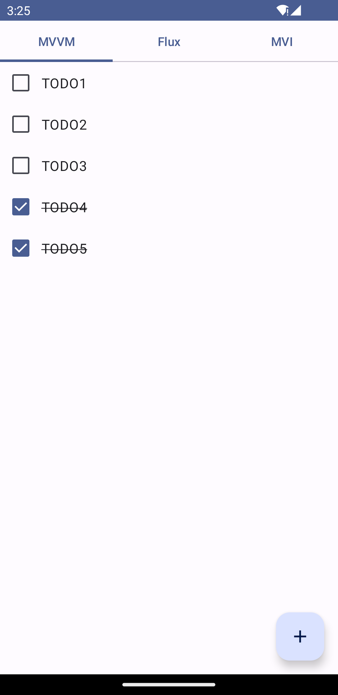

# back-in-time-evaluation

## This repository is no-longer maintained.

The demo project on this repository is moved under [back-in-time-plugin](https://github.com/kitakkun/back-in-time-plugin) repository.
It is available with the name 'backintime-demo'.

> [!NOTE]
> This project is created to evaluate if [back-in-time-plugin](https://github.com/kitakkun/back-in-time-plugin) works well on different architecture patterns(MVVM, Flux, MVI).

## What is this app?

This project is a simple TODO list application.
We can add a TODO item, mark it checked, rename it, and delete it.
There are three tabs, and each tab has a different architecture implementation.

